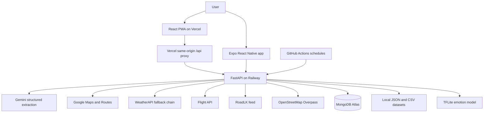

# TourUni Project Handoff

Last updated: 2026-07-22

This document is the source of truth for continuing TourUni in another coding agent or IDE. It describes the project as it exists now, not only the original proposal. Read this file before changing the backend, PWA, mobile app, database, deployment, or scheduling logic.

## 1. Executive Summary

TourUni is a Sri Lanka-focused AI travel planner with:

- A conversational, phase-based trip intake.
- International flight search and selection.
- Sri Lanka route and itinerary generation.
- Attraction and accommodation selection.
- Budget allocation across flights, accommodation, and transport.
- Google route geometry and map display.
- Weather, crowd, holiday, tourism-demand, Wikipedia-interest, and RoadLK intelligence.
- Day-by-day travel briefings and contextual fallback suggestions.
- User accounts and MongoDB-backed trip sessions.
- Facial emotion classification, mood history, and nearby activity suggestions.
- A production PWA and an in-progress Expo React Native port.
- Scheduled condition refreshes and mood-check reminder generation.

The production backend is a FastAPI service deployed on Railway. The production frontend is a Vite/React PWA deployed on Vercel. The active mobile port is a separate Expo project beside the main repository.

## 2. Sources of Truth

Use these paths:

| Area | Source of truth | Status |
| --- | --- | --- |
| Backend | `clean_run/` | Active and deployed |
| PWA frontend | `reactui/` | Active and deployed |
| React Native app | `/Users/dilshantharushika/Desktop/routemvp/touruni-mobile` | Active port, not yet production |
| Main attractions | `clean_run/data/sri_lanka_attractions.json` | Active curated dataset |
| Main accommodation data | `clean_run/data/sri_lanka_accommodations.json` | Active curated dataset |
| Emotion model | `clean_run/emotion/models/emotion_rafdb5.tflite` | Active runtime model |
| Backend tests | `clean_run/tests/` | Active |

Do not treat these as current sources of truth:

- `mobile/` inside the main repository is an older Expo prototype.
- Historical Streamlit or older route-planner folders outside `clean_run` are legacy.
- Experimental OpenStreetMap dataset-expansion files were removed. Overpass is only used for dynamic suggestions.
- Hugging Face Docker deployment and its GitHub sync workflow are no longer the production deployment path.

## 3. Current Deployment

| Service | URL | Purpose |
| --- | --- | --- |
| Railway backend | `https://tourunipp2-production.up.railway.app` | FastAPI API |
| Backend health | `https://tourunipp2-production.up.railway.app/health` | Configuration and health check |
| Vercel PWA | `https://tourproject-nu.vercel.app` | Production web/PWA frontend |

The Railway service currently listens on the platform-provided `PORT`. Its logs have shown Uvicorn running on port 8080 in production.

## 4. High-Level Architecture



## 5. End-to-End User Flow

The flow is intentionally split into flight and Sri Lanka trip phases. Do not merge them back into one uncontrolled planner call.

### 5.1 Authentication and session resume

1. The user can sign up or log in with email and password.
2. The frontend keeps the short-lived access token in memory.
3. A rotating refresh token is stored in a secure HTTP-only cookie.
4. On app load, the frontend attempts token refresh and then requests the latest saved session.
5. If the user is authenticated and has a saved session, Get Started should resume that plan instead of restarting intake.
6. If no saved session exists, the app begins the flight intake.

### 5.2 Flight phase

The flight phase collects one field at a time:

- Flight origin city or airport.
- Departure date.
- Passenger count.
- Cabin class.
- Total trip budget in LKR.

When complete:

1. The frontend calls `POST /flights/search`.
2. The backend searches the exact requested date.
3. If no fares are available, it searches a one-week window.
4. The frontend displays flight options and preselects the best-value result.
5. The user must press the equivalent of **Use selected flight**.
6. That button calls `POST /flights/confirm`.
7. Only after confirmation may the app enter the Sri Lanka trip phase.

This is a hard gate. Never automatically skip from flight extraction to trip questions before the user confirms a displayed flight.

### 5.3 Sri Lanka trip phase

The trip phase collects:

- Sri Lanka origin.
- Sri Lanka destination.
- Duration in days.

The selected flight and its LKR cost are already known. The remaining budget is passed into the trip planner.

When the trip fields are complete, the frontend calls `POST /plan` automatically and shows a meaningful loading screen while route, hotels, crowd windows, weather, and itinerary are produced.

### 5.4 Result phase

The result dashboard exposes:

- Route map and real Google route geometry.
- Route/day markers.
- Daily itinerary and attraction details.
- Accommodation selections and prices.
- Selected flight and booking link.
- Budget summary.
- Crowd intelligence.
- Weather conditions.
- RoadLK warnings.
- Day-by-day briefing and recommendations.
- Context-aware alternatives.
- Mood check-ins, mood history, recovery, and activity suggestions.

## 6. Repository Layout

```text
tourunipp2/
├── clean_run/                  # Production FastAPI backend
│   ├── api.py                  # Main FastAPI app and endpoints
│   ├── auth/                   # JWT, password, refresh token, auth routes/services
│   ├── data/                   # Production JSON/CSV datasets
│   ├── emotion/                # Emotion inference and place recommendation runtime
│   ├── enrich/                 # Crowd, weather, road, tourism and related enrichment
│   ├── flights/                # Flight API integration, fallback search, selection
│   ├── intake/                 # Structured conversational extraction and phase control
│   ├── integrations/           # External service clients
│   ├── notifications/          # Condition updates and reminder generation
│   ├── pipeline/               # Planner orchestration
│   ├── postprocess/            # Result shaping and cleanup
│   ├── recommendations/        # Daily briefing and contextual alternatives
│   ├── routes/                 # Route generation and route scoring
│   ├── storage/                # MongoDB client, repositories, session loading
│   ├── trip/                   # Trip-resolution and itinerary logic
│   ├── tests/                  # Backend test suite
│   └── requirements.txt
├── reactui/                    # Production React/Vite PWA
│   ├── src/App.jsx
│   ├── src/api.js
│   ├── src/components/
│   └── ...
├── mobile/                     # Older Expo prototype; do not extend
├── data/                       # Historical/working data tools and legacy artifacts
├── docs/                       # Project documentation
├── emotion_model_service/      # Isolated model experiments/service work
├── Dockerfile                  # Production backend container
└── .github/workflows/
    └── scheduled-intelligence.yml
```

The active Expo app is outside this Git repository:

```text
/Users/dilshantharushika/Desktop/routemvp/touruni-mobile/
```

## 7. FastAPI Backend

### 7.1 API inventory

Authentication:

- `POST /auth/signup`
- `POST /auth/login`
- `POST /auth/refresh`
- `POST /auth/logout`
- `GET /auth/me`

General and planning:

- `GET /`
- `GET /health`
- `POST /chat`
- `POST /flights/search`
- `POST /flights/confirm`
- `POST /plan`

Session reads:

- `GET /sessions/latest`
- `GET /sessions/{session_id}`
- `GET /sessions/{session_id}/dashboard`
- `GET /sessions/{session_id}/chatbot-context`
- `GET /sessions/{session_id}/emotion-targets`

Condition notifications:

- `GET /sessions/{session_id}/condition-notifications`
- `POST /sessions/{session_id}/condition-notifications/read-all`
- `POST /sessions/{session_id}/condition-notifications/{notification_id}/read`

Intelligence and alternatives:

- `POST /sessions/{session_id}/refresh-intelligence`
- `POST /sessions/{session_id}/contextual-alternatives`

Emotion check-ins:

- `POST /sessions/{session_id}/emotion-checkins`
- `POST /sessions/{session_id}/emotion-checkins/image`

Internal scheduled endpoints:

- `POST /internal/scheduled/refresh-conditions`
- `POST /internal/scheduled/mood-reminders`

### 7.2 Conversational extraction

The chat endpoint is phase-aware and uses structured outputs rather than relying on free-form assistant text.

Important behavior:

- The flight extractor only handles flight fields and total budget.
- The trip extractor only handles Sri Lanka origin, destination, and duration.
- Existing session fields and chat history are included so one-word or conversational replies can be interpreted in context.
- Backend validation determines which fields are still missing.
- The assistant asks for one missing field at a time.
- Deterministic normalization still handles airport codes, dates, passenger counts, cabin classes, and numeric budgets.
- The LLM does not get to mark intake complete when required validated fields are absent.

Do not replace this with brittle keyword matching. Do not let assistant wording alone control phase completion.

### 7.3 Flight service

The flight service is separate from the route planner.

Key behavior:

- Destination is Colombo, `CMB`.
- Origin names such as Dubai are normalized to airport codes such as `DXB`.
- Exact-date cached-fare search is attempted first.
- A weekly fallback window is automatically used when the exact date has no result.
- Flight options carry price, airline, schedule, passenger/cabin details, and a booking/deep link when available.
- The selected flight price is converted to LKR using `FLIGHT_USD_TO_LKR_RATE`.
- The selected flight cost is subtracted from the total budget before accommodation planning.
- `/flights/confirm` is the explicit user-confirmation gate.

### 7.4 Planner pipeline

The planner resolves, in broad order:

1. Validated trip requirements.
2. Google route alternatives and route geometry.
3. Route selection.
4. Attraction candidates close to the route.
5. Daily distribution of attractions.
6. Accommodation candidates near overnight areas.
7. Accommodation ranking against the remaining budget.
8. Transport cost estimate.
9. Weather, crowd, holiday, tourism, Wikipedia, and road enrichment.
10. Daily recommendations and dashboard shaping.
11. MongoDB persistence.

The actual itinerary should never be silently replaced by the crowd recommender. Crowd and weather alternatives are suggestions unless the user explicitly accepts one.

## 8. Data and External Services

### 8.1 Curated local datasets

- `clean_run/data/sri_lanka_attractions.json`
- `clean_run/data/sri_lanka_accommodations.json`
- `clean_run/data/bus_fares_normal_2026.csv`
- `clean_run/data/tourism/sltda_weekly_arrivals.csv`
- `clean_run/data/wiki_pageviews/attraction_monthly_pageviews.csv`
- `clean_run/data/wiki_pageviews/attraction_pageview_attempts.csv`

The attraction and accommodation JSON files are the primary planning datasets. Do not replace them with raw Overpass results.

### 8.2 Google Maps and Routes

Google is used for geocoding and route generation.

- Render the decoded Google route polyline, not a fake straight line between markers.
- A visually indirect route may still be correct if Google selected a faster highway route.
- Day markers should be positioned on or meaningfully near the route based on daily progression.
- Attraction markers may be off-route when the attraction itself is a detour, but route/day markers should not be arbitrary coordinates.
- The frontend must label route fallback states honestly if geometry is unavailable.

### 8.3 Weather

The backend uses weather APIs with fallback behavior. The dashboard should display actual weather information, including when available:

- Condition text.
- Rain probability.
- Temperature.
- Wind.
- Daily risk/severity.
- Practical advice.

Do not reduce weather to a single score in the UI.

A 99 percent rain probability does not automatically mean severe weather. Probability describes likelihood, while disruption severity should consider intensity, condition type, wind, warnings, and planned activity exposure. The UI should distinguish `rain probability` from `travel disruption risk` so a high probability with moderate drizzle is not confusing.

### 8.4 RoadLK

RoadLK contributes road incidents and route-disruption pressure. Its feed may contain sparse, old, unknown, verified, or resolved fields. The UI should show the best available location, type, status, proximity, and source timestamp without inventing missing details.

### 8.5 OpenStreetMap Overpass

Overpass is used only for dynamic, temporary recommendations:

- Mood/interest-based nearby activities.
- Weather-appropriate alternatives.
- Crowd-relief alternatives near a planned attraction.

It is not the primary attraction dataset.

Dynamic results should:

- Use the current/day location as the search center.
- Filter unnamed, incomplete, duplicate, already-planned, or obviously irrelevant places.
- Match selected interests.
- Rank by weather suitability, crowd relief, distance, metadata quality, and interest fit.
- Include a map link.
- Be presented as suggestions, not itinerary mutations.

These temporary alternatives do not need permanent MongoDB storage unless the user selects one.

## 9. Scoring and Selection Logic

### 9.1 Route selection

Google can return multiple route alternatives. The planner considers:

- Travel duration.
- Distance.
- Route compatibility with planned attractions.
- Quality and distribution of reachable attractions.

If the product requirement changes to strictly shortest distance or strictly fastest duration, make that an explicit scoring mode. Do not make the map lie about the selected geometry.

### 9.2 Attraction selection

Attractions are ranked using a combination of:

- Distance/proximity to the selected route or daily anchor.
- Dataset quality/rating and attraction importance.
- Geographic distribution across the trip.
- Duplicate prevention across days.
- Suitability for the daily route segment.

Do not fix duplicate itinerary attractions only in the frontend. The backend should ideally produce unique daily attractions. If a travel day has no suitable unique attraction, label it as a travel or transfer day with its actual route segment rather than duplicating the previous day.

### 9.3 Accommodation selection

Accommodation ranking considers:

- Distance to the day/overnight location.
- Rating and review/quality proxies.
- Nightly lodging budget.
- Remaining total accommodation budget.
- A high-budget preference that avoids choosing the cheapest low-quality stay solely because it is cheap.
- A penalty for options unrealistically cheap relative to a high budget when stronger options exist.

Display one selected stay per overnight stay. Alternative hotel candidates may be shown separately, but the UI must not imply that two hotels are booked for one night.

The lodging total must be the sum of selected stays, not the entire remaining budget allocation.

### 9.4 Budget flow

The intended budget flow is:

```text
Total budget
  - selected flight total in LKR
  = remaining Sri Lanka budget

Remaining Sri Lanka budget
  -> accommodation budget
  -> transport estimate
  -> remaining/unallocated amount
```

The UI must distinguish:

- Available accommodation budget.
- Actual selected accommodation cost.
- Flight cost.
- Estimated transport cost.
- Actual/estimated total spent.
- Remaining budget.

Do not display the available accommodation allocation as though it were fully spent.

### 9.5 Transport estimate

The transport estimate uses the bus-fare dataset and trip/route distance as an MVP estimate. It is not a live ticket quote. Label it as estimated.

## 10. Crowd Intelligence

The crowd model estimates relative visitor pressure, not literal visitor headcount.

Signals include:

- SLTDA tourist-arrival trends from 2024 and 2025.
- Monthly Wikipedia pageview interest for attractions.
- Attraction importance/popularity tier.
- Weekend effects.
- Holiday demand.
- Weather disruption.
- RoadLK disruption.
- Live traffic when available; otherwise traffic is explicitly unknown.

The combined output includes:

- Overall trip pressure.
- Daily pressure.
- Attraction-level pressure where matching data is available.
- Relative score and low/medium/high label.
- Preferred visit windows.
- Heatmap/map data.
- Explanatory text and alternatives.

Important limitations:

- This is a proxy model because Sri Lanka does not provide live attraction turnstile counts for the project.
- Wikipedia views represent interest, not physical attendance.
- SLTDA arrivals are national demand, not attraction attendance.
- Never label the estimate as an exact crowd count.
- When attraction-level data is absent, show an honest day-level estimate rather than empty anonymous rows or `NaN` values.

## 11. Daily Briefing and Contextual Recommendations

The dashboard should organize recommendations by day. For each day, include:

- Date and location/route segment.
- Expected crowd pressure and preferred window.
- Actual weather condition and disruption risk.
- Road warnings relevant to the segment.
- Planned attractions and each attraction's condition.
- Selected overnight stay and price.
- Practical timing recommendation.
- Optional lower-pressure/weather-safe alternatives.

Recommendation notifications should be based on a change or actionable risk, for example:

> Heavy rain is now likely near Galle Fort this afternoon. Visit the nearby indoor museum first and return to the fort after 4:30 PM when pressure is expected to ease.

Scheduled refreshes create condition update records. They do not automatically rewrite the itinerary.

## 12. Emotion and Tips Module

### 12.1 Runtime model

The active runtime model is:

```text
clean_run/emotion/models/emotion_rafdb5.tflite
```

The classifier uses face detection, a padded square crop aligned with the original training/inference preprocessing, image resizing/normalization, and five classes:

- Anger.
- Happy.
- Neutral.
- Sad.
- Surprise.

The model output is a wellbeing signal, not a mental-health diagnosis.

### 12.2 Check-in modes

The system supports:

- Manual emotion selection.
- Image upload to the opt-in image endpoint.
- Structured emotion metadata check-ins.

Raw photos should not be stored permanently. Persist only the prediction/check-in metadata needed for history, recovery, and recommendations.

### 12.3 Interests

The exact supported UI interest categories are:

- Nature.
- Culture.
- Food.
- Photography.
- Sports.
- Wellness.
- Arts.
- Shopping.

### 12.4 Recommendations

Tips use:

- Current or selected itinerary location.
- Current day.
- Emotion and confidence.
- User interests.
- Weather/crowd/road context.
- Overpass nearby places.

The top recommendation should be visibly marked as Top Pick and explain why it matches the emotion and interests. Suggestions should include distance, approximate duration, best time, weather suitability, and map link when available.

### 12.5 Mood journey and recovery

The product tracks check-ins across trip checkpoints. It can show:

- Emotion history on the route.
- Mood timeline/graph.
- Current checkpoint/attraction.
- Change from the previous check-in.
- A recovery score or trend.

For the current demo, location can be selected from planned itinerary attractions. The future real implementation should use GPS with permission and proximity checks.

### 12.6 Reminder gating

Scheduled mood reminders should not begin for a session until the user has completed at least one manual mood check-in. This prevents irrelevant reminders before the feature is activated.

## 13. MongoDB Persistence

MongoDB Atlas stores the full trip session as a rich snapshot. Avoid over-normalizing the MVP.

The session document conceptually contains:

```json
{
  "session_id": "uuid",
  "user_id": "optional authenticated user id",
  "created_at": "timestamp",
  "updated_at": "timestamp",
  "trip_requirements": {},
  "flight": {},
  "budget": {},
  "route": {},
  "route_options": [],
  "itinerary": [],
  "accommodations": [],
  "transport": {},
  "weather": {},
  "crowd": {},
  "roads": {},
  "recommendations": [],
  "daily_briefing": [],
  "condition_updates": [],
  "condition_notifications": [],
  "emotion_checkins": [],
  "mood_history": [],
  "metadata": {}
}
```

Exact field shapes can evolve, so consumers should use the dashboard endpoints instead of directly coupling to raw Mongo fields.

Recommended indexes include:

- Unique `session_id`.
- `user_id` and `updated_at` for latest-session lookup.
- `created_at`.
- `updated_at`.
- Relevant trip requirement dates/destinations when needed.

The same MongoDB database also stores:

- Users.
- Refresh-token hashes.
- The configured trip-session collection.

## 14. Authentication and Security

- Passwords are hashed with Argon2.
- Access JWT lifetime defaults to 15 minutes.
- Access tokens are kept in frontend memory.
- Refresh tokens are random, rotating, and stored as SHA-256 hashes in MongoDB.
- The raw refresh token is sent only as an HTTP-only cookie.
- Production cookies use `Secure`.
- PWA production API requests use the same-origin `/api` proxy so Safari can send the secure cookie reliably.
- Authenticated plans store `user_id`; anonymous planning remains supported.
- Session reads must enforce ownership where authentication is involved.
- Internal scheduler endpoints require `X-Cron-Secret`.
- Never log or commit API keys, JWT secrets, refresh tokens, MongoDB passwords, or raw user photos.

## 15. PWA Frontend

### 15.1 Stack

- React 18.
- Vite 5.
- Leaflet and React Leaflet.
- Deployed to Vercel.

### 15.2 Main files

- `reactui/src/App.jsx`
- `reactui/src/api.js`
- `reactui/src/components/`

Important components include:

- `GetStarted`
- `AuthScreen`
- `AccountScreen`
- `ChatIntake`
- `FlightOptions`
- `LoadingState`
- `PlanDashboard`
- `TripMapModule`
- `RouteMap`
- `ItinerarySection`
- `AccommodationSection`
- `BudgetSummary`
- `CrowdIntelligenceSection`
- `DailyBriefingSection`
- `TripUpdatesSection`
- `StartOfDayCheckin`
- `MoodJourneyMap`

### 15.3 API client behavior

The PWA uses:

```js
const API_BASE = (
  import.meta.env.VITE_API_BASE_URL ||
  (import.meta.env.DEV ? "http://127.0.0.1:7860" : "/api")
).replace(/\/$/, "");
```

Requests use `credentials: "include"`. When a non-auth request gets 401, the client calls `/auth/refresh`, stores the returned access token in memory, and retries once.

Production should use:

```text
VITE_API_BASE_URL=/api
```

Do not casually replace this with a direct Railway URL in the PWA because the same-origin proxy is important for secure refresh-cookie behavior on mobile Safari.

### 15.4 Current design direction

The client requested a premium dark-green travel interface. Preserve functionality and improve hierarchy rather than radically changing the design.

Known design concerns:

- Some result screens became too information-dense.
- Muted text can have insufficient contrast.
- Long day cards need progressive disclosure/collapsible details.
- Loading screens should be centered, readable, and show a clear current step.
- Maps, warnings, recommendations, and daily details must not become decorative clutter.

## 16. Expo React Native App

### 16.1 Active project

Use:

```text
/Users/dilshantharushika/Desktop/routemvp/touruni-mobile
```

Do not continue the older `tourunipp2/mobile` prototype.

### 16.2 Stack

- Expo SDK `~57.0.2`.
- React Native `0.86.0`.
- React `19.2.3`.
- TypeScript.
- React Navigation native stack.
- React Native Maps.
- Expo Image Picker.
- Expo File System/fetch for image upload.
- Expo Linear Gradient.

### 16.3 Navigation

- Get Started.
- Auth.
- Account.
- Flight Intake.
- Flight Options.
- Trip Intake.
- Plan Result.

### 16.4 Current parity

The mobile port includes or has scaffolding for:

- Authentication and latest-session resume.
- Flight intake/search/options/confirmation hard gate.
- Trip intake and plan generation.
- Route, Crowd, Weather, Roads, and Tips tabs.
- Real route geometry when available.
- Daily itinerary, stays, flight, and budget views.
- Condition notifications and refresh.
- Mood check-ins, Overpass tips, history/checkpoints/recovery.
- In-app 30-second demonstration loops.

Treat the PWA as the visual and behavioral reference while using native components rather than wrapping the website in a WebView.

### 16.5 Current iPhone blocker

The project currently targets Expo SDK 57. The public App Store version of Expo Go available during the last test supported SDK 54, so the phone displayed:

```text
Project is incompatible with this version of Expo Go
```

Options:

1. Downgrade the app to the SDK supported by Expo Go.
2. Use an EAS development build for the current SDK.
3. Use an iOS simulator after installing Xcode.
4. Continue current-SDK testing on Android emulator/web.

The `xcrun simctl` error on the Mac is caused by missing/incomplete Xcode tools. It does not prevent Android or physical-device LAN development by itself.

## 17. Scheduled Intelligence and Demo Refresh

There are two separate concepts. Do not confuse them.

### 17.1 Production/background scheduler

GitHub Actions calls internal Railway endpoints.

Workflow:

```text
.github/workflows/scheduled-intelligence.yml
```

Schedules:

- Condition refresh: `17 0,12 * * *`, equivalent to 05:47 and 17:47 Asia/Colombo.
- Mood-reminder job: `37 */2 * * *`, with backend local-hour gating.

The workflow also supports manual dispatch for all jobs, only conditions, or only mood reminders.

Required GitHub repository secrets:

```text
SCHEDULER_API_BASE_URL=https://tourunipp2-production.up.railway.app
SCHEDULER_CRON_SECRET=<same value as Railway CRON_SECRET>
```

The workflow was manually rerun successfully after the secret name was corrected.

To pause scheduled jobs, disable the workflow or remove/comment the schedule triggers. Do not intentionally corrupt the secret as an on/off switch.

### 17.2 In-app 30-second demo mode

The client requested demonstrable toggles while the app remains open:

- Conditions auto-refresh every 30 seconds when enabled.
- Mood prompt/check-in demo can repeat every 30 seconds when enabled.
- Turning a toggle off keeps the last displayed state.

This is a foreground UI demonstration loop, not a reliable production background scheduler. React Native apps are suspended in the background, so future real notifications require push infrastructure.

## 18. Notifications Roadmap

Implemented now:

- Condition update records.
- Read/unread state.
- Highlighted actionable recommendations.
- Scheduled mood reminder generation.
- Frontend notification/alert presentation.

Not yet fully implemented:

- Native APNs/FCM delivery.
- Expo push-token registration.
- Per-device notification preferences.
- Deep linking from a push notification to a day/attraction.

Future React Native push flow:

1. Request notification permission.
2. Obtain Expo push token.
3. Associate token with authenticated user/device in MongoDB.
4. Scheduler creates an actionable condition notification.
5. Backend sends push through Expo/FCM/APNs.
6. User taps notification and opens the relevant trip day.

## 19. Environment Variables

Never put actual values in this document or Git.

### 19.1 Backend/Railway

Required or actively used:

```text
GOOGLE_MAPS_API_KEY
GEMINI_API_KEY
WEATHER_API_KEY
FLIGHT_API_TOKEN
MONGODB_URI
MONGODB_DATABASE
MONGODB_COLLECTION
JWT_SECRET
CORS_ALLOW_ORIGINS
CRON_SECRET
```

Optional/configurable:

```text
MONGODB_USERNAME
MONGODB_PASSWORD
JWT_ISSUER=touruni-api
JWT_AUDIENCE=touruni-pwa
ACCESS_TOKEN_MINUTES=15
REFRESH_TOKEN_DAYS=30
REFRESH_COOKIE_NAME=touruni_refresh_token
COOKIE_SECURE=true
FLIGHT_USD_TO_LKR_RATE=300
CHAT_LLM_TIMEOUT_SECONDS
SCHEDULER_TIMEZONE=Asia/Colombo
SCHEDULER_LOOKAHEAD_DAYS=7
MOOD_REMINDER_START_HOUR=8
MOOD_REMINDER_END_HOUR=20
PORT
```

Generate secure JWT and cron values with:

```bash
openssl rand -hex 32
```

### 19.2 PWA/Vercel

```text
VITE_API_BASE_URL=/api
```

The Vercel rewrite/proxy must forward `/api/*` to the Railway backend while preserving paths and cookies.

### 19.3 Active Expo app

```text
EXPO_PUBLIC_BACKEND_URL=https://tourunipp2-production.up.railway.app
```

### 19.4 GitHub Actions

```text
SCHEDULER_API_BASE_URL
SCHEDULER_CRON_SECRET
```

## 20. Local Development Commands

### 20.1 Backend

```bash
cd /Users/dilshantharushika/Desktop/routemvp/tourunipp2
conda activate touruni
python -m pip install -r clean_run/requirements.txt
uvicorn clean_run.api:app --host 0.0.0.0 --port 7860 --reload
```

Health check:

```bash
curl http://127.0.0.1:7860/health
```

Backend tests:

```bash
cd /Users/dilshantharushika/Desktop/routemvp/tourunipp2
conda activate touruni
python -m unittest discover -s clean_run/tests -p 'test_*.py'
```

### 20.2 PWA

```bash
cd /Users/dilshantharushika/Desktop/routemvp/tourunipp2/reactui
npm install
npm run dev -- --host 0.0.0.0 --port 4173
```

Production build:

```bash
npm run build
```

### 20.3 Active Expo app

```bash
cd /Users/dilshantharushika/Desktop/routemvp/touruni-mobile
npm install
npx tsc --noEmit
npx expo start --lan --clear
```

Android emulator:

```bash
npm run android
```

Web preview:

```bash
npm run web
```

If LAN is unavailable, tunnel mode requires `@expo/ngrok`. The earlier automatic global installation failed with npm exit code 243, so prefer LAN on the same Wi-Fi or install the compatible package deliberately.

### 20.4 Docker backend

```bash
cd /Users/dilshantharushika/Desktop/routemvp/tourunipp2
docker build -t touruni-backend .
docker run --env-file clean_run/.env -p 7860:7860 touruni-backend
```

## 21. Test Inventory

The backend contains tests for:

- Auth API and auth service.
- Clean API and full pipeline.
- Condition updates.
- Contextual alternatives.
- Crowd client.
- Daily briefing.
- Emotion places and emotion service.
- Flight service.
- Intake service.
- Lodging budget.
- Route generation.
- Scheduled jobs.
- Session loader and repository.
- Tourism demand.
- Transport cost.
- Trip resolution.
- Weather client and weather engine.
- Wikipedia pageview client.

Test files currently include:

```text
test_auth_api.py
test_auth_service.py
test_clean_api.py
test_clean_pipeline.py
test_condition_updates.py
test_contextual_alternatives.py
test_crowd_client.py
test_daily_briefing.py
test_emotion_places.py
test_emotion_service.py
test_flights_service.py
test_intake_service.py
test_lodging_budget.py
test_route_generation.py
test_scheduled_jobs.py
test_session_loader.py
test_session_repository.py
test_tourism_demand_client.py
test_transport_cost.py
test_trip_resolution.py
test_weather_client.py
test_weather_engine.py
test_wiki_pageviews_client.py
```

External APIs should be mocked in unit tests. Run a separate explicit integration smoke test when real keys and network access are available.

## 22. Known Limitations and Risks

1. **Expo iPhone compatibility:** SDK 57 cannot currently open in the installed App Store Expo Go build. Use a compatible SDK or development build.
2. **Traffic:** A reliable live traffic data source is not always available, so the crowd explanation may correctly report live traffic as unknown.
3. **RoadLK quality:** Incident metadata can be incomplete or old. Do not fabricate precise road locations/statuses.
4. **Crowd estimates:** They are relative proxy estimates, not exact visitor counts.
5. **Wikipedia coverage:** Not every attraction has a useful page/title match. Missing pageviews must not produce `NaN`.
6. **Overpass reliability:** Public servers can time out or rate-limit. Use retries, bounded radius, alternate endpoints, and short caching.
7. **Flight cache:** Exact dates may have no cached fares. Weekly fallback is required.
8. **Booking links:** Some flight providers do not return a direct purchasable URL. Use the best legitimate provider/deep/search link and label it honestly.
9. **Mongo network access:** Atlas IP/network rules can block local or hosted clients. Do not hide persistence failures with local fallback storage in production.
10. **Scheduled push delivery:** Jobs create records/reminders, but native push delivery is future work.
11. **Weather semantics:** Rain probability and disruption severity need separate labels to avoid confusing 99 percent probability with only medium disruption.
12. **Frontend density:** Result screens need careful progressive disclosure on phones.
13. **Demo loops:** The 30-second loops only work while the app is active and are not production background execution.

## 23. Non-Negotiable Regression Rules

Any tool continuing this project must obey these rules:

1. Do not modify the working chatbot flow unless the task explicitly requires it.
2. Keep flight and trip extraction as separate phases.
3. Keep flight search outside the main `/plan` flow.
4. Do not start trip intake until the user confirms a displayed flight through `/flights/confirm`.
5. Preserve the exact-date to one-week flight fallback.
6. Use the selected flight cost before calculating the remaining accommodation budget.
7. Do not display an accommodation budget allocation as actual accommodation spending.
8. Do not duplicate attractions across days.
9. Do not silently auto-replace itinerary attractions with crowd/weather suggestions.
10. Use real Google route geometry; label any fallback map honestly.
11. Do not replace the curated main attraction dataset with Overpass.
12. Do not claim crowd scores are exact people counts.
13. Never show `NaN`, unnamed attractions, empty anonymous rows, or invented RoadLK details.
14. Preserve authenticated latest-session resume.
15. Preserve same-origin PWA `/api` auth behavior and secure-cookie support.
16. Do not persist raw face images.
17. Do not begin scheduled mood reminders until a manual mood check-in exists.
18. Do not treat the 30-second demo loop as a production scheduler.
19. Do not revive the old in-repo `mobile/` app instead of the active `touruni-mobile` app.
20. Do not commit `.env`, `atlas-credentials.env`, API keys, tokens, or passwords.

## 24. Recommended Next Work

Priority order:

1. Decide the iPhone development path: Expo SDK downgrade or EAS development build.
2. Complete native mobile parity screen by screen, using the PWA as the reference.
3. Run a full backend test suite and production API smoke test after every backend change.
4. Add native push-token registration and notification delivery.
5. Refine weather presentation to separate probability from disruption severity.
6. Improve mobile result-page progressive disclosure and contrast without removing data.
7. Harden Overpass retry/cache behavior.
8. Add explicit itinerary alternative acceptance if users should modify a plan.
9. Add GPS-based checkpoint detection after the demo location selector is stable.
10. Add formal evaluation metrics for the university report: NLP extraction accuracy, route response time, budget compliance, crowd proxy validation, and emotion model accuracy.

## 25. End-to-End Acceptance Checklist

Before calling the system complete, verify all of the following.

### Auth

- Sign up works.
- Login works.
- Refresh restores the session after page reload.
- Logout clears access.
- A logged-in user resumes their latest plan.
- One user cannot read another user's session.

### Flight flow

- First question asks for flight origin.
- One-field replies advance correctly.
- Origin names normalize to airport codes.
- Budget phrases such as `500000`, `around 500000`, and `500,000 LKR` parse correctly.
- Exact date search works.
- Weekly fallback works.
- Flight options display price and a legitimate link.
- Trip intake cannot begin before flight confirmation.

### Trip flow

- Sri Lanka origin, destination, and duration extract correctly.
- One-shot and step-by-step replies both work.
- Plan generation auto-triggers only when validated fields are complete.
- Loading screen communicates progress.

### Plan

- Route geometry is from Google.
- Markers align meaningfully with route/day progression.
- Attractions do not repeat across days.
- Daily distances and route segments are sensible.
- One selected accommodation appears per overnight stay.
- Accommodation prices sum correctly.
- Flight, accommodation, transport, spent, and remaining budget are consistent.

### Intelligence

- Weather shows actual condition and values, not only score.
- Crowd scores have no `NaN` and are labeled relative estimates.
- Attraction-level crowd rows include real names.
- RoadLK warnings show available type/status/location/source honestly.
- Daily briefing contains actionable advice.
- Contextual alternatives match weather, crowd, distance, and interests.
- Suggestions do not mutate the plan without user confirmation.

### Emotion/tips

- Manual emotion works.
- Image check-in works where enabled.
- Raw image is not persisted.
- Interest selection affects rankings.
- Top Pick is visibly meaningful.
- Mood history and recovery update after repeated check-ins.
- Reminder generation is gated by the first manual check-in.

### Scheduling

- Manual GitHub workflow run succeeds.
- Condition refresh produces update/notification records.
- Mood reminder job deduplicates slots.
- Scheduler secret mismatch fails securely.
- 30-second in-app demo toggles stop cleanly when disabled.

### Mobile

- TypeScript compiles.
- Android emulator completes the full flow.
- Physical-device backend URL is reachable.
- Auth/session resume works on device.
- Maps and image upload work with native permissions.
- iPhone testing uses a compatible Expo/runtime strategy.

## 26. Instructions for a New Coding Agent

Paste this at the start of the next agent task:

```text
Read PROJECT_HANDOFF.md completely before making changes. Treat clean_run as the backend source of truth, reactui as the production PWA, and /Users/dilshantharushika/Desktop/routemvp/touruni-mobile as the active Expo app. Do not modify the working chatbot or flight-to-trip phase gate unless explicitly requested. Inspect the actual files related to the task, preserve existing behavior, implement the requested change end to end, run relevant tests, and report any external-service limitation honestly. Never expose or commit secrets.
```

## 27. Final Product Intent

TourUni is an MVP and university demonstration, but its architecture should remain honest:

- AI extracts user intent; deterministic validation controls completion.
- Google provides real routes.
- Curated datasets provide primary attractions/accommodations.
- External APIs enrich the plan.
- Crowd intelligence is an explainable relative estimate.
- Recommendations advise rather than silently rewrite.
- MongoDB preserves user/session continuity.
- The PWA is production today; React Native is the intended cross-platform app.
- Scheduled updates prepare the system to become proactive without pretending that foreground demo loops are background services.

Preserve this separation and the project can continue to evolve without repeating the earlier chatbot, routing, persistence, and frontend regressions.
